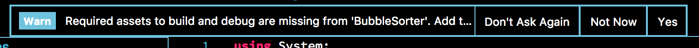
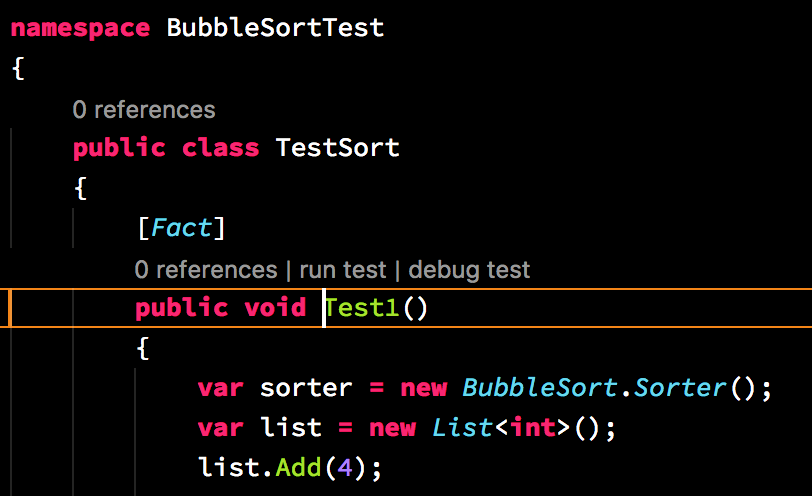

# How to Debug C# (.Net Core) with VSCode

## Summary

* [Basic](#Basic)
* [Spec](#Spec)
* [install](#install)
* [debugging unit test (XUnit)](#debugging-unit-test-xunit)
* [debugging Console Program](#debugging-console-program)
* [debugging ASP.NET](#debugging-asp-net)
* [attach to local process](#attach-to-local-process)
* [attach to remote process](#attach-to-remote-process)

## Basic

* [Welcome to .NET Core!](https://dotnet.github.io/)
* Extension: [C#](https://marketplace.visualstudio.com/items?itemName=ms-vscode.csharp)
* Debugger: .NET Core function
* module code: [BubbleSort/BubbleSorter.cs](https://github.com/74th/vscode-debug-specs/blob/master/csharp/BubbleSort/BubbleSorter.cs)

## Spec

* OS
  * ✅ MacOS
  * ✅ Windows
  
  * ✅ Linux
* Break Point
	* ✅ break point
	* ✅ condition break point
	* ❌ function breakpoint
* Step Execution
	* ✅ Step Over
	* ✅ Step Into
	* ✅ Step Out
	* ✅ Continue
* Variables
	* ✅ variables views
	* ✅ watch variables
* Call Stack
	* ✅ call stack
* Evaluation
	* ✅ eval expression to show variables
	* ✅ eval expression to change variables
* Type of Execution
	* ✅ debug unit test
	* ✅ debug executable package
    * ✅ remote debugging
	* ✅ ASP.NET Core

## install

* [install .net Core SDK](https://www.microsoft.com/net/core)
* [install Extension](https://marketplace.visualstudio.com/items?itemName=ms-vscode.csharp)
* When you open C# code, it'll start to install necessary tools.

## debugging unit test (XUnit)

* test code: [BubbleSortTest/TestSort.cs](https://github.com/74th/vscode-debug-specs/blob/master/csharp/BubbleSortTest/TestSort.cs)

### Inline

1. open xunit code.
2. click Yes to message "Required assets to build and debug are missin from ...



3. show Inline



## debugging Console Program

* Console Program code: [BubbleSorter/Program.cs](https://github.com/74th/vscode-debug-specs/blob/master/csharp/BubbleSorter/Program.cs)

### way need to open project dir

1. change VSCode dir to the project dir.
2. open C# code in the project.
3. click Yes to message "Required assets to build and debug are missing from ...


### way no need to open project dir

add tasks.json to build task

tasks.json
```json
{
	"version": "0.1.0",
	"command": "dotnet",
	"isShellCommand": true,
	"args": [],
	"tasks": [
		{
			// if you need multiple tasks, change taskName
			"taskName": "build",
			"args": [
				"${workspaceRoot}/BubbleSorter/BubbleSorter.csproj"
			],
			"isBuildCommand": true,
			"problemMatcher": "$msCompile"
		}
	]
}
```

add the debug setting to launch.json  (Add Configuration Menu: '.NET: launch .NET Core Console App').

launch.json
```json
{
	"version": "0.2.0",
	"configurations": [
		{
			"name": ".NET Core Launch (console)",
			"type": "coreclr",
			"request": "launch",
			// set build task name
			"preLaunchTask": "build",
			// set dll path
			"program": "${workspaceRoot}/BubbleSorter/bin/Debug/netcoreapp2.0/BubbleSorter.dll",
			"args": [
				"4",
				"3",
				"2",
				"1"
			],
			// set project dir path
			"cwd": "${workspaceRoot}/BubbleSorter",
			"console": "internalConsole",
			"stopAtEntry": false,
			"internalConsoleOptions": "openOnSessionStart"
		}
	]
}
```

## debugging ASP.NET

* WebAPI source: [BubbleSorterAPI/Controller/BubbleSortController.cs](https://github.com/74th/vscode-debug-specs/blob/master/csharp/BubbleSorterAPI/Controllers/BubbleSortController.cs)
* WebClient source: [BubbleSorterAPI/wwwroot/index.html](https://github.com/74th/vscode-debug-specs/blob/master/csharp/BubbleSorterAPI/wwwroot/index.html)

add the debug setting to launch.json (Add Configuration Menu: '.NET: launch a .NET Core Web App').

```json
{
	"version": "0.2.0",
	"configurations": [
		{
            "name": ".NET Core Launch (web)",
            "type": "coreclr",
            "request": "launch",
            "preLaunchTask": "build",
            "program": "${workspaceRoot}/BubbleSorterAPI/bin/Debug/netcoreapp2.1/BubbleSorterAPI.dll",
            "args": [],
            "cwd": "${workspaceRoot}/BubbleSorterAPI",
            "stopAtEntry": false,
            "launchBrowser": {
                "enabled": true,
                "args": "${auto-detect-url}",
                "windows": {
                    "command": "cmd.exe",
                    "args": "/C start ${auto-detect-url}"
                },
                "osx": {
                    "command": "open"
                },
                "linux": {
                    "command": "xdg-open"
                }
            },
            "env": {
                "ASPNETCORE_ENVIRONMENT": "Development"
            }
        }
	]
}
```

access http://localhost:5000/index.html and debug.

## attach to local process

add settings to launch.json.

```json
{
	"version": "0.2.0",
	"configurations": [
		{
			"name": ".NET Core Attach",
			"type": "coreclr",
			"request": "attach",
			"processId": "${command:pickProcess}"
		}
	]
}
```

### how-to

 1. launch .NET Core app

```sh
cd BubbleSorterAPI
dotnet run
```

 2. start a debug
 3. select the process

## attach to remote process

install vsdbg to remote host (following script install to ~/vsdbg).

```sh
curl -sSL https://aka.ms/getvsdbgsh | bash /dev/stdin -v latest -l ~/vsdbg
```

add settings to launch.json.

```json
{
	"version": "0.2.0",
	"configurations": [
		{
			"name": ".NET Core remote Attach",
			"type": "coreclr",
			"request": "attach",
			"processId": "${command:pickRemoteProcess}",
			"sourceFileMap": {
				// create a map between remote and local directory
				// "remote host directory" : "VSCode(local) directory"
				"/home/nnyn/vscode-debug-specs/csharp": "/Users/nnyn/Documents/vscode-debug-specs/csharp"
			},
			"pipeTransport": {
				"pipeCwd": "${workspaceRoot}",
				"pipeProgram": "ssh",
				// set remote host and ssh setting
				"pipeArgs": [ "-T", "nnyn@192.168.64.6" ],
				// set remote vsdbg path
				"debuggerPath": "~/vsdbg/vsdbg"
			}
		}
	]
}
```

### how-to

 1. start .NET App at remote host

```sh
# access remote host
ssh nnyn@192.168.64.6
# run .NET App
cd vscode-debug-specs/csharp/BubbleSorterAPI
dotnet run
```

 2. start debug
 3. select process

