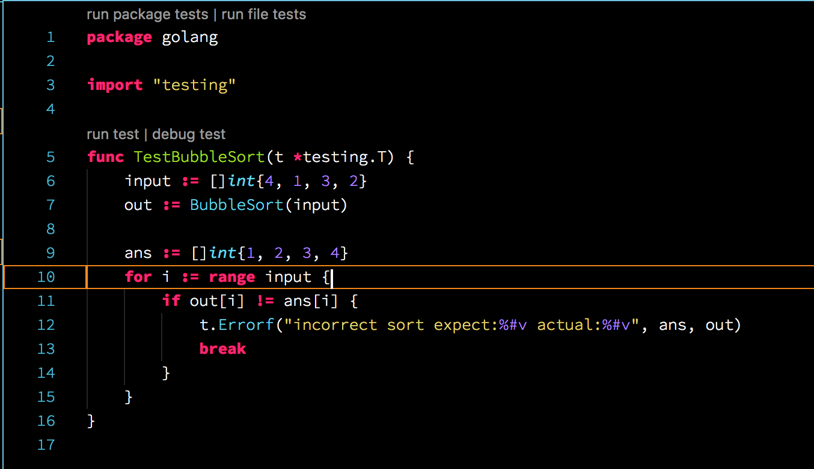

# How to Debug Golang with VSCode

## Summary

* [Basic](#basic)
* [Spec](#spec)
* [Instruction](#instruction)
* [debugging unit test](#debugging-unit)
* [debugging executable file](#debugging-executable-file)
* [debugging remote process](#debugging-remote-debug)
* [debugging running process](#debugging-running-process)

## Basic

* [The Go Programming Language](https://golang.org/)
* Extension: [Go](https://marketplace.visualstudio.com/items?itemName=lukehoban.Go)
* Debugger: [delve](https://github.com/derekparker/delve)
* module code: [bubbleSort.go](https://github.com/74th/vscode-debug-specs/blob/master/golang/bubbleSort.go)

## Spec

* OS
	* ✅ MacOS
	* ✅ Windows
	* ✅ Linux
* Break Point
	* ✅ break point
	* ✅ condition break point
	* ❌ function breakpoint
* Step Execution
	* ✅ Step Over
	* ✅ Step Into
	* ✅ Step Out
	* ✅ Continue
* Variables
	* ✅ variables views
	* ✅ watch variables
* Call Stack
	* ✅ call stack
* Evaluation
	* ✅ eval expression to show variables
	* ❌ eval expression to change variables
* Type of Execution
	* ✅ debug unit test
	* ✅ debug executable package
	* ✅ remote debugging

## Instruction

* note: [Delve official instraction](https://github.com/derekparker/delve/tree/master/Documentation/installation)

### MacOS

1. install golang : `brew install golang`
1. add go/bin to PATH
2. install xcode : `xcode-select --install`
2. install Delve : `go get github.com/derekparker/delve`
3. [install extension "Go"](https://marketplace.visualstudio.com/items?itemName=lukehoban.Go)
4. install other tools: `F1`->`Go: Install/Update Tools`

* note: when I used `brew install delve`, unit test inline executions did not work in my machine.

### Windows

1. install golang and add go/bin to PATH
2. install Delve: `go get github.com/derekparker/delve`
3. [install extension "Go"](https://marketplace.visualstudio.com/items?itemName=lukehoban.Go)
4. install other tools: `F1`->`Go: Install/Update Tools`

### Linux

1. install golang and add go/bin to PATH
2. install Delve: `go get github.com/derekparker/delve`
3. [install extension "Go"](https://marketplace.visualstudio.com/items?itemName=lukehoban.Go)
4. install other tools: `F1`->`Go: Install/Update Tools`

## unit test

source : [bubbleSort_test.go](https://github.com/74th/vscode-debug-specs/blob/master/golang/bubblesorter/bubbleSort_test.go)

### inline



### launch json

menu:`Go: Launch test function`

```
{
	"version": "0.2.0",
	"configurations": [
		{
			"name": "Launch test function",
			"type": "go",
			"request": "launch",
			"mode": "test",
			"program": "${workspaceRoot}",
			"args": [
				"-test.run",
				// test function name
				// * can use reguler expression
				// * NOT include "Test"
				// * the first charactor MUST be small
				"bubblesort"
			]
		}
	]
}
```

* `program` must be package folder

## debugging executable file

source: [bubblesorter/cmd/bubbleSorter/main.go](https://github.com/74th/vscode-debug-specs/blob/master/golang/bubblesorter/cmd/bubbleSorter/bubbleSorter.go)

### launch.json

menu:`Go: Launch package`

```
{
	"version": "0.2.0",
	"configurations": [
		{
			"name": "Launch Package",
			"type": "go",
			"request": "launch",
			"mode": "debug",
			"program": "${workspaceRoot}/bubblesorter/cmd/bubbleSorter"
		}
	]
}
```

* `program` must be main package folder or *.go file

## debugging at remote machine

source: [bubblesorter/cmd/bubbleSorter/main.go](https://github.com/74th/vscode-debug-specs/blob/master/golang/bubblesorter/cmd/bubbleSorter/bubbleSorter.go)

### prepare

```sh
cd bubblesorter/cmd/bubbleSorter/
dlv debug --headless --listen=0.0.0.0:2345 --log
```

### launch.json

```json
{
	"version": "0.2.0",
	"configurations": [
		{
			"name": "Launch Remote",
			"type": "go",
			"request": "launch",
			"mode": "remote",
			// remotePath must be remote package path
			"remotePath": "/home/nnyn/go/src/github.com/74th/vscode-debug-specs/golang/bubblesorter/cmd/bubblesorter",
			"port": 2345,
			"host": "192.168.56.101",
			// program must be remote package path
			"program": "${workspaceRoot}/bubblesorter/cmd/bubblesorter",
			"env": {},
			"args": [],
			"showLog": true
		}
	]
}
```

## debugging running remote process

For comfortable debugging it is necessary to build avoiding the optimization option.

```sh
cd cmd/bubbleSorter/
go build -gcflags '-N -l'
```

```sh
cd cmd/bubbleSorter/
# runnning process
./bubbleSorter -sleep 30 &
PID=$!
dlv attach $PID ./bubbleSorter --headless --listen=0.0.0.0:2345 --log
```

launch.json is same settings as remote debug;
