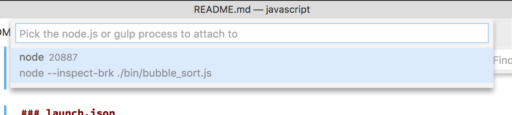

# Javascript(Nodejs)

## Summary

* [Basic](#basic), [Spec](#spec)
* Unit Test: [mocha](#mocha-unit-test-framework), [jasmine](#jasmine)
* [executable file debug](#executable-file-debug)

## Basic

* [nodejs](https://nodejs.org/)
* Extension: build-in
* Debugger: node
* target module code: [bubble_sort.js](bubble_sort.js)

## Spec

* OS
	* ✅ MacOS
	* ✅ Windows
	* ✅ Linux
* Break Point
	* ✅ break point
	* ✅ condition break point
	* ❌ function breakpoint
* Step Execution
	* ✅ Step Over
	* ✅ Step Into
	* ✅ Step Out
	* ✅ Continue
	* ❌ Step Back
	* ❌ Move To
	* ❌ Pause
* Variables
	* ✅ variables views
	* ✅ watch variables
* Call Stack
	* ✅ call stack
* Evaluation
	* ✅ eval expression to show variables
	* ✅ eval expression to change variables
* Type of Execution
	* ✅ debug unit test
	* ✅ debug executable package
	*  remote debugging

## Instraction

no other instraction.

## [mocha](https://mochajs.org/) (unit test framework)

```
npm install --save-dev mocha assert
```

### launch.json

* test code: [mocha/bubble_sort.test.js](mocha/bubble_sort.test.js)
* menu: "Node.js: Mocha Tests"

```json
{
	"version": "0.2.0",
	"configurations": [
		{
			"type": "node",
			"request": "launch",
			"name": "Mocha Tests",
			"program": "${workspaceRoot}/node_modules/mocha/bin/_mocha",
			"args": [
				"-u",
				"tdd",
				"--timeout",
				"999999",
				"--colors",
				"${workspaceRoot}/mocha",
				"-g",
				"bubble_sort"
			],
			"internalConsoleOptions": "openOnSessionStart"
		}
	]
}
```

## [jasmine](https://jasmine.github.io/)

```
npm install --save-dev jasmine-node assert
```

### launch.json

* test code: [jasmine/bubble_sort.spec.js](jasmine/bubble_sort.spec.js)
* menu: "Node.js: Launch Program"

```json
{
	"version": "0.2.0",
	"configurations": [
		{
			"type": "node",
			"request": "launch",
			"name": "Jasmine-node Tests",
			"program": "${workspaceRoot}/node_modules/jasmine-node/lib/jasmine-node/cli.js",
			"cwd": "${workspaceRoot}",
			"args": [
				"./jasmine",
				"--color"
			],
			"internalConsoleOptions": "openOnSessionStart"
		}
	]
}
```

### Problom

* When I set breakpoint to first line, debug didn't stop.

## executable file debug

* Program: [bin/bubble_sort.js](bin/bubble_sort.js)

### launch.json

```json
{
	"version": "0.2.0",
	"configurations": [
		{
			"type": "node",
			"request": "launch",
			"name": "Launch Program",
			"program": "${workspaceRoot}/bin/bubble_sort.js",
			"internalConsoleOptions": "openOnSessionStart"
		}
	]
}
```

## attach running process

* menu: Node.js: Attach to Process

### launch.json

```json
{
	"version": "0.2.0",
	"configurations": [
		{
			"type": "node",
			"request": "attach",
			"name": "Attach by Process ID",
			"processId": "${command:PickProcess}"
		}
	]
}
```

### how-to

1. run program with inspect options
	* when you like to break a first line, add `--inspect-brk` option

```sh
node --inspect --inspect-brk ./bin/bubble_sort.js
```

2. start debug
3. select process id
	* 

## remote process

### launch.json

* menu: Node.js: Attach to Remote Program

```json
{
	"version": "0.2.0",
	"configurations": [
		{
			"type": "node",
			"request": "attach",
			"name": "Attach to Remote",
			"address": "localhost",
			"port": 5858,
			"localRoot": "${workspaceRoot}",
			"remoteRoot": "${workspaceRoot}"
		}
	]
}
```

### how-to

1. run program with inspect options
	* when you like to break a first line, add `--inspect-brk` option

```sh
node --inspect=5858 --inspect-brk ./bin/bubble_sort.js
```

2. start debug
