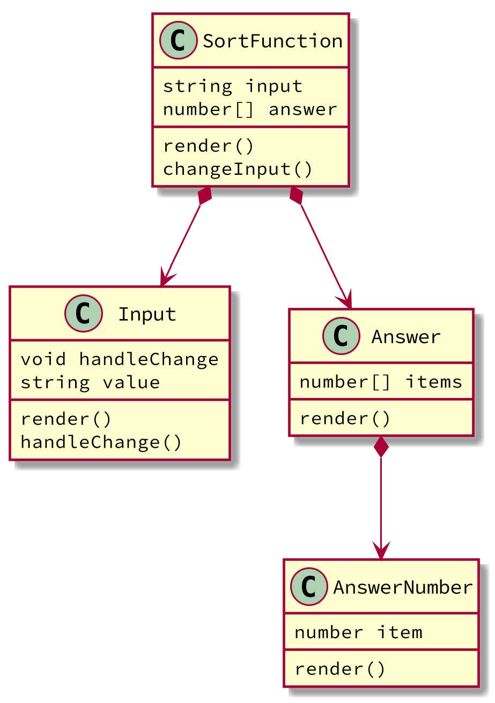

# React

A declarative, efficient, and flexible JavaScript library for building user interfaces.

* [React(official)](https://reactjs.org/)
* [React(github)](https://github.com/facebook/react)

## spec

[this is same spec as javascript for chrome](../javascript_chrome/)

## react with ES2015 modules

You need to use babel for compiling react(jsx).

### instruction

* `npm install --save-dev babel-cli babel-plugin-transform-react-jsx`
* setup .babelrc for jsx react

```json
{
  "plugins": ["transform-react-jsx"],
  "sourceMaps": true,
  "sourceRoot": "src"
}
```

### directory structure

* html/
	* js/ : output directory
	* index.html
* src/
	* js/
		* bubble_sort.js
		* index.jsx

### codes



* [html/index.html](https://github.com/74th/vscode-debug-specs/blob/master/javascript_react/html/index.html): script tag has `type="module"`

```html
<!DOCTYPE html>
<html lang="en">
<head>
<script crossorigin src="https://unpkg.com/react@16/umd/react.development.js"></script>
<script crossorigin src="https://unpkg.com/react-dom@16/umd/react-dom.development.js"></script>
</head>
<body>
	<h1>React(jsx)</h1>
	<div id="container" ></div>
	<script type="module" src="js/index.js"></script>
</body>
</html>
```

* [src/js/index.jsx](https://github.com/74th/vscode-debug-specs/blob/master/javascript_react/src/js/index.jsx)
* [src/js/bubble_sort.js](https://github.com/74th/vscode-debug-specs/blob/master/javascript_react/src/js/bubble_sort.js)

### build

```sh
./node_module/babel -D src/js -d html/js --source-maps
```

### .vscode/launch.json

```json
{
	"version": "0.2.0",
	"configurations": [
		{
			"type": "chrome",
			"request": "launch",
			"name": "Launch Chrome against localhost",
			"url": "http://localhost:8080",
			"sourceMaps": true,
			"sourceMapPathOverrides": {
			},
			"webRoot": "${workspaceFolder}"
		}
	]
}
```

## for typescript react (.tsx)

You need to use webpack.
Typescript compiler cannnot build ES2015 modules. Its import sentences have no '.js'.

### instraction

```
npm install --save-dev @types/react @types/react-dom react react-dom typescript webpack webpack-cli ts-loader
```

#### tsconfig.json

```json
{
  "compilerOptions": {
    "target": "ES2018",
    "module": "es2015",
    "jsx": "react",
    "sourceMap": true,
    "strict": true,
    "moduleResolution": "node",
    "esModuleInterop": true
  }
}
```

#### webpack.config.js

```javascript
const path = require('path');

module.exports = {
	mode: 'development',
	entry: './src/ts/index_ts.tsx',
	devtool: 'inline-source-map',
	module: {
		rules: [
			{
				test: /\.tsx?$/,
				use: 'ts-loader',
				exclude: /node_modules/
			}
		]
	},
	resolve: {
		extensions: ['.tsx', '.ts', '.js']
	},
	output: {
		filename: './js/index_ts.js',
		path: path.resolve(__dirname, 'html')
	}
};
```

### directory structure

* html/
	* js/
		* index_ts.js : output file 
	* index.html
* src/
	* ts/
		* bubble_sort_ts.ts
		* index_ts.tsx

### codes

* [src/ts/index.tsx](https://github.com/74th/vscode-debug-specs/blob/master/javascript_react/src/ts/index_ts.tsx)
* [src/ts/bubble_sort_ts.ts](https://github.com/74th/vscode-debug-specs/blob/master/javascript_react/src/ts/bubble_sort_ts.ts)

### build

```sh
./node_modules/webpack-cli
```
