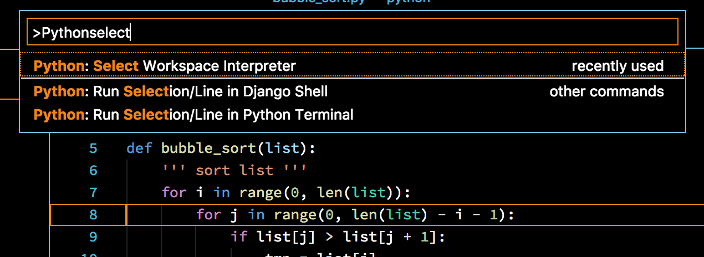
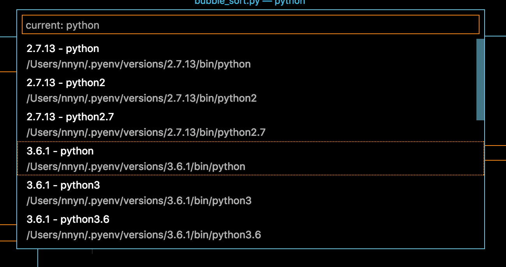
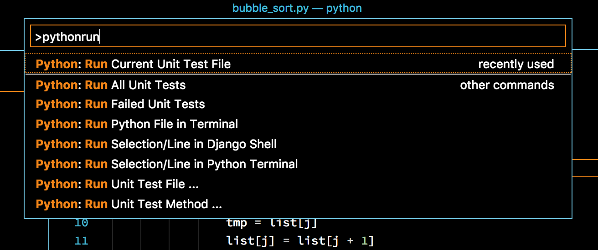
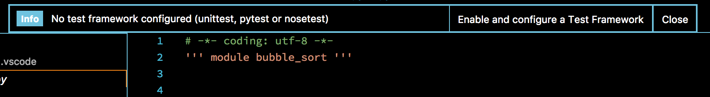
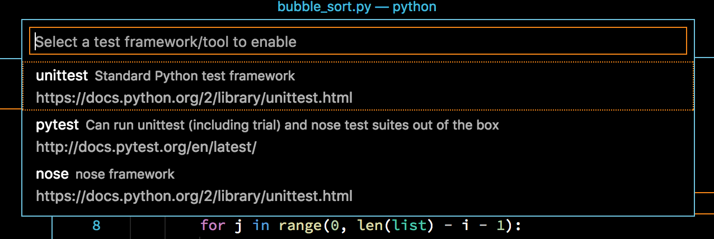
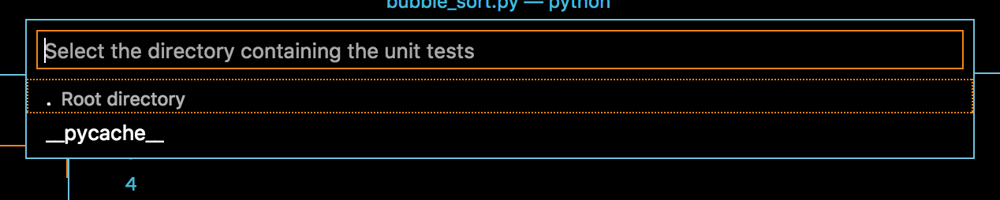
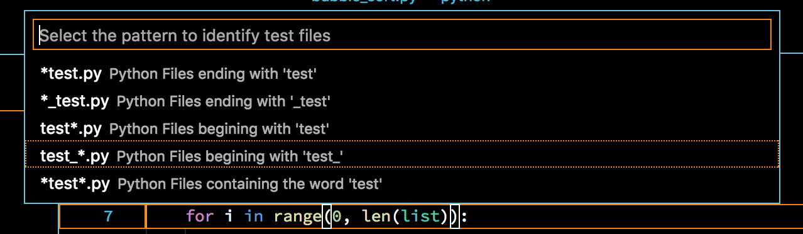
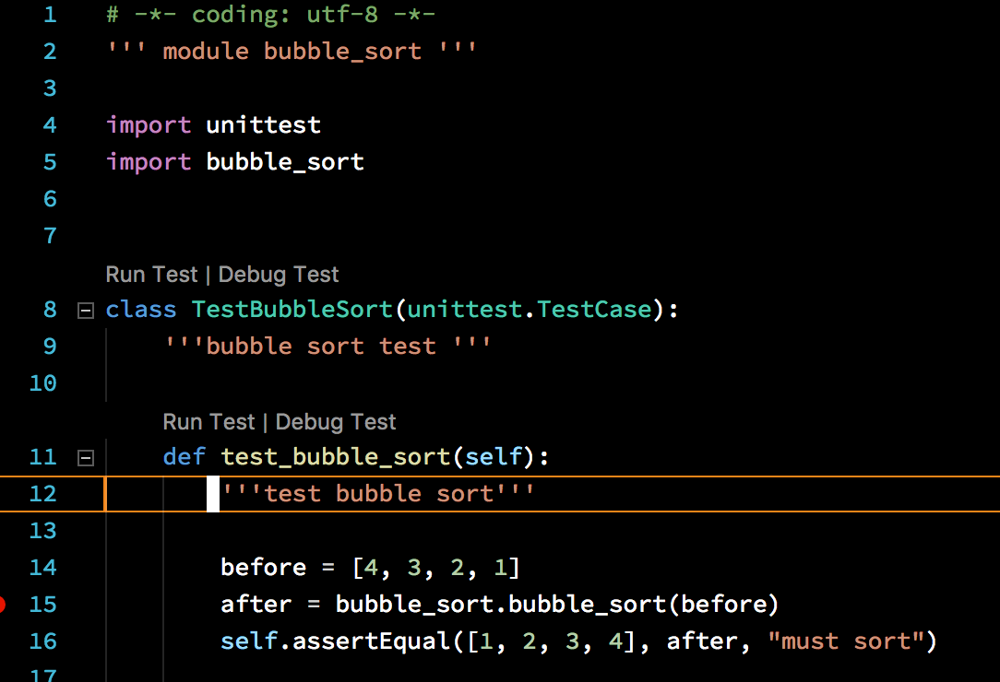
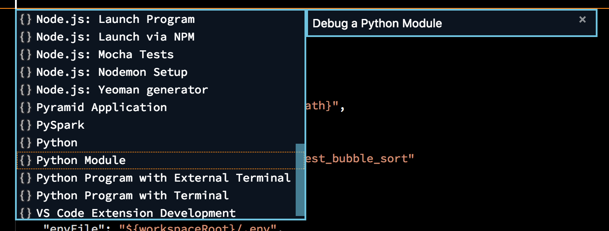
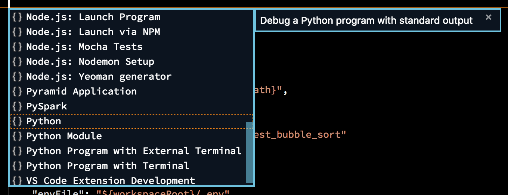

# Python

## Summary

* [Basic](#basic)
* [Google App Engine](#google-app-engine)

## Basic

* [Python.org](https://www.python.org/)
* Extension: [Python](https://marketplace.visualstudio.com/items?itemName=donjayamanne.python)
* Debugger: Python

## Spec

* OS
	* ✅ MacOS
	* TODO Windows
	* ✅ Linux
* Break Point
	* ✅ break point
	* ❓ condition break point : it does not work on my machine, always breaks
	* ❌ function breakpoint
	* ✅ uncaught exception breakpoint
	* ✅ all exception breakpoint
* Step Execution
	* ✅ Step Over
	* ✅ Step Into
	* ✅ Step Out
	* ✅ Continue
* Variables
	* ✅ variables views
	* ✅ watch variables
* Call Stack
	* ✅ call stack
* Eva* OS
	* ✅ MacOS
	* ✅ Windows
	* ✅ Linux
* Break Point
	* ✅ break point
	* ✅ condition break point
	* ❌ function breakpoint
* Step Execution
	* ✅ Step Over
	* ✅ Step Into
	* ✅ Step Out
	* ✅ Continue
* Variables
	* ✅ variables views
	* ✅ watch variables
* Call Stack
	* ✅ call stack
* Evaluation
	* ✅ eval expression to show variables
	* ❌ eval expression to change variables
* Type of Execution
	* ✅ debug unit test
	* ✅ debug executable package
	* ✅ remote debugging
luation
	* ✅ eval expression to show variables
	* ✅ eval expression to change variables
* Type of Execution
	* ✅ debug unit test
	* ✅ debug executable package
	* ❓ remote debugging

## Instraction

Only installing Extension.

### additional

If you want to pyenv or other environment tools, select your environment with belong way.

`F1`->`Python: Select Workspace Interpreter`





## unit test

### inline

`F1`->`Python: Run Current Unit Test File`



`Enable and configure a Test Framework.`->select your test framework.




sample: `unittest`->`.`->`test_*`




Codelens on test function shows run and debug test button.



TODO: but it does not on my machine.

### use launch.json

Menu: Python:Python module



```json
{
    "version": "0.2.0",
    "configurations": [
        {
            "name": "Python Module",
            "type": "python",
            "request": "launch",
            "stopOnEntry": true,
            "pythonPath": "${config:python.pythonPath}",
            "module": "unittest",
            "args": [
                // test package
                // <test_file>
                // <test_file>.<test_class>
                // <test_file>.<test_class>.<test_method>
                "test_bubble_sort.TestBubbleSort.test_bubble_sort"
            ],
            "cwd": "${workspaceRoot}",
            "env": {},
            "envFile": "${workspaceRoot}/.env",
            "debugOptions": [
                "WaitOnAbnormalExit",
                "WaitOnNormalExit",
                "RedirectOutput"
            ]
        }
    ]
}
```

### debug with integrated terminal

Menu: Python: Python program with Integrated Terminal/Console

```
{
    "version": "0.2.0",
    "configurations": [
        {
			"name": "Integrated Terminal/Console",
			"type": "python",
			"request": "launch",
			"stopOnEntry": true,
			"pythonPath": "${config:python.pythonPath}",
			"program": "bubble_sorter.py",
			"cwd": "",
			"console": "integratedTerminal",
			"env": {},
			"envFile": "${workspaceRoot}/.env",
			"debugOptions": [
				"WaitOnAbnormalExit",
				"WaitOnNormalExit"
			]
        }
    ]
}
```

## executable file debug



### launch.json

```json
{
    "version": "0.2.0",
    "configurations": [
        {
            "name": "Python",
            "type": "python",
            "request": "launch",
            "stopOnEntry": true,
            "pythonPath": "${config:python.pythonPath}",
            //"program": "${file}",
            "program": "bubble_sorter.py",
            "args": [
                "4",
                "3",
                "2",
                "1"
            ],
            "cwd": "${workspaceRoot}",
            "env": {},
            "envFile": "${workspaceRoot}/.env",
            "debugOptions": [
                "WaitOnAbnormalExit",
                "WaitOnNormalExit",
                "RedirectOutput"
            ]
        }
    ]
}
```

## remote debug

TODO: not work on my machine!

### prepare

install pyvsd package

```sh
pip install ptvsd
```

### code

add remote debug code.

```python
import ptvsd

ptvsd.enable_attach("nnyn", address=('0.0.0.0', 2345))
ptvsd.wait_for_attach()
```

run follow command.

```sh
python bubble_sorter_for_remote.py 4 3 2 1
```

### launch.json

```json
{
	"version": "0.2.0",
	"configurations": [
		{
			"name": "Attach (Remote Debug)",
			"type": "python",
			"request": "attach",
			"localRoot": "${workspaceRoot}",
			"remoteRoot": "${workspaceRoot}",
			"port": 3000,
			"secret": "my_secret",
			"host": "localhost"
		}
	]
}
```

## Dojango Application

TODO: Django Application

## Google App Engine

TODO: Google App Engine Application

